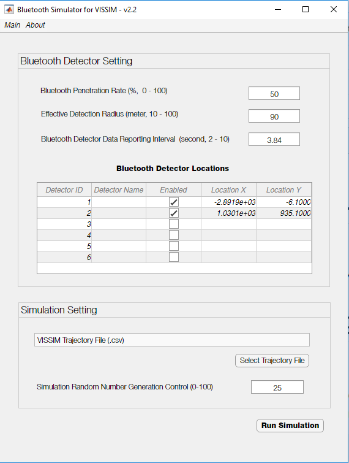
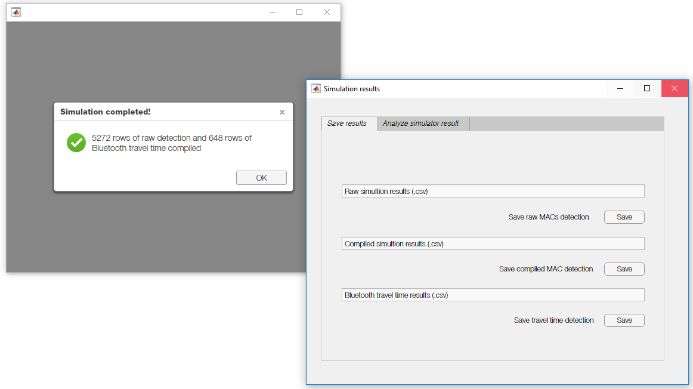
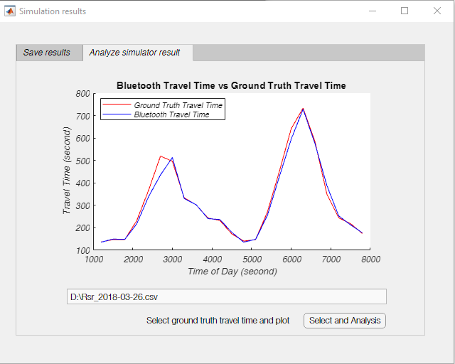

# Bluetooth Simulator for Vissim
## Interfaces

## Date Input Format

The raw output of .RSR (VISSIM travel time output) and .Fzp(VISSIM vehicle trajectory output) should be converted to .CSV first with the Python script in another repository [ParseVissimFzpRsr](https://github.com/wenfuwang/ParseVissimFzpRsr/blob/master/README.md)

Run/Install the software 
--------------------------------

1-MCRInstaller.exe 

NOTE: Verify that version 9.3 (R2017b) of the MATLAB Runtime is installed. If the MATLAB Runtime is not installed, you can run the MATLAB Runtime installer.

To find its location, enter

    >>mcrinstaller
Alternatively, download and install the Windows version of the MATLAB Runtime for R2017b from the following link on the MathWorks website:

    http://www.mathworks.com/products/compiler/mcr/index.html

NOTE: You will need administrator rights to run the MATLAB Runtime installer. 

2-MyAppInstaller_web.exe

